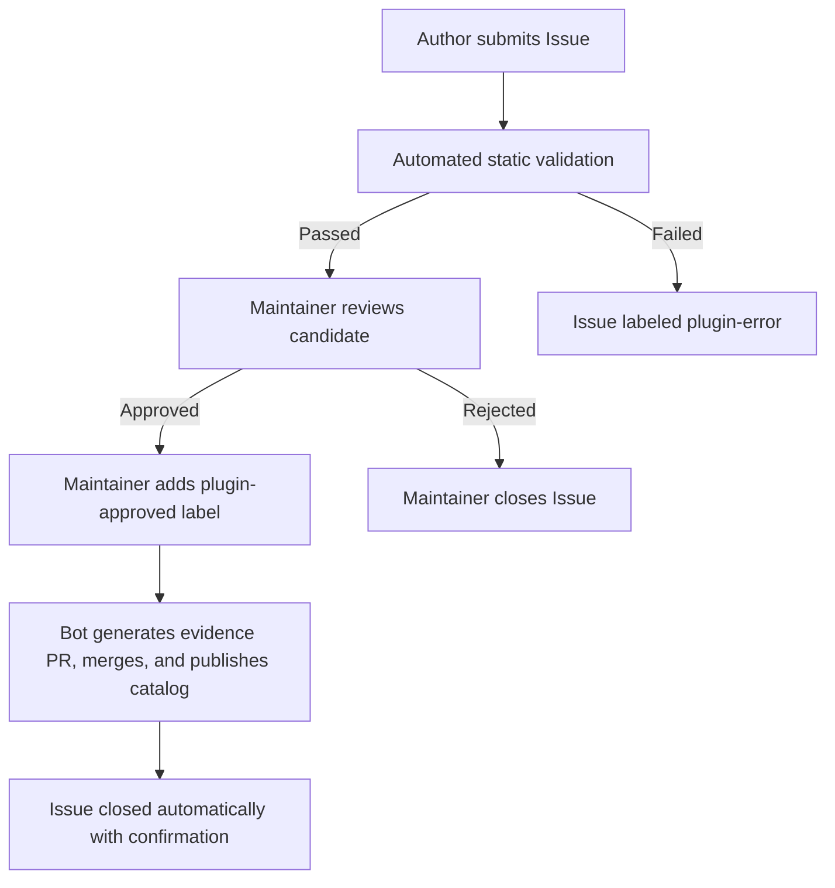

# Phinix Plugin Index

  English · <a href="./README.zh-CN.md">简体中文</a>

The official plugin catalog and automated admission repository for Phinix managed plugins.

Plugin authors host open-source code and release assets in their own public GitHub repositories; this repository stores reviewed metadata, cryptographic hashes, and immutable catalog releases.

---

## Architecture & Responsibilities

- **Author Repositories**: Source code and immutable release ZIPs (`.zip` containing DLLs, `manifest.json`, and language JSON).
- **Index Repository**: Public metadata catalog, intake issue automation, maintainer approval receipts, and release snapshots.
- **Distribution Endpoints**: Authoritative GitHub direct access (`phinix.official`) and Cloudflare acceleration (`https://plugins.hunyuan2333.com`).
- **Game Client**: Discovers and downloads reviewed packages through the in-game Plugin Store.

> [!NOTE]
> The index manages metadata and admissions; it does **not** execute plugin code or run game servers. Acceptance into the catalog verifies package structure and metadata integrity, but does not certify runtime behavioral safety.

---

## Author Submission Guide

Authors submit plugins by opening an issue using the official template. No personal access tokens or custom bots are required.

### 1. Preparation

Before submitting, ensure your plugin release fulfills these requirements:
- **Public Repository**: Hosted on GitHub with public visibility.
- **Fixed Release**: Published GitHub Release (drafts and prereleases are not accepted).
- **Managed DLL ZIP**: Contains `manifest.json`, plugin assemblies, and package-scoped localization files (`Resources/Localization/*.json`).
- **No Bundled Dependencies**: Do not include game assemblies (`Assembly-CSharp.dll`, `UnityEngine*.dll`), host assemblies (`ClientExtensionAbstractions.dll`, `Utils.dll`), or Harmony.
- **No Credentials**: Never include API keys, secrets, or personal paths.

Refer to [Phinix Example Plugin](https://github.com/HunYuan2333/Phinix-Example-Plugin) for a reference package layout and release structure.

### 2. Submit the Candidate

1. Navigate to **Issues → New Issue → Plugin submission**.
2. Complete the form using the format defined in [`examples/managed-submission.json`](examples/managed-submission.json).
3. The candidate metadata specifies:
   - `id`: Unique package ID (e.g., `author.plugin.name`).
   - `version`: Semantic version string (e.g., `1.0.0`).
   - `artifact`: Release URL, asset ID, asset name, and SHA-256 digest of the downloaded ZIP.
   - `manifest`: Exact copy of your plugin's `manifest.json`.
   - `localization`: Localized names, summaries, and changelogs.

### 3. Automated Validation Feedback

Upon submission or modification, the **Plugin intake** workflow automatically runs static checks:
- Strict JSON Schema validation.
- Verification of repository ownership, tag, and commit SHA.
- Check that release asset ID, size, and SHA-256 match the published GitHub release.
- Static PE and manifest inspection to confirm declared assemblies and dependencies.

The workflow posts a diagnostic summary directly to the issue.

---

## Review & Publication Process

### Review Rules

1. **Maintainer Approval**: Only authorized repository maintainers can approve an application by applying the **`plugin-approved`** label. Authors must **never** add approval labels to their own submissions.
2. **Automated Evidence PR**: Applying `plugin-approved` triggers the admission workflow, creating and automatically merging an evidence-only pull request that records candidate hashes, review metadata, and policy locks.
3. **Catalog Publication**: Once merged, the publication workflow validates the visible dependency closure, generates an immutable `catalog-v3-<commit>` release, and updates `stable.json`.
4. **Issue Closure**: Upon successful publication, the issue is automatically closed.
5. **Rejection**: If a submission is declined, maintainers close the issue without adding `plugin-approved`.

---

## Troubleshooting & Corrections

| Label | Meaning | Action Required |
| :--- | :--- | :--- |
| `plugin-intake` | Automated check in progress | Wait for the bot to post the verification summary. |
| `plugin-error` | Validation or publication failed | Check the workflow log and issue comments for error details. |
| `plugin-approved` | Maintainer has approved the candidate | Automated PR merge and catalog release are underway. |

### How to Fix Errors

- **Metadata or Asset Mismatch**: If the release ZIP was modified after submission, recalculate the SHA-256 and update the candidate JSON in the issue body. Editing the issue triggers a fresh intake check.
- **Transient Failures**: If a network failure occurs during admission, maintainers can remove and re-add `plugin-approved` to trigger re-admission.

---

## Catalog Distribution & Client Access

- **Authoritative Source**: `phinix.official` (tracked via `stable.json` on the `main` branch).
- **Cloudflare Gateway**: Serves cached immutable metadata and assets at `https://plugins.hunyuan2333.com/v1/sources/phinix.official/stable`.
- **Client Synchronization**: Players can manually switch between GitHub Direct and CF Acceleration in the in-game settings.
- **Update Scope**: Catalog publication makes packages discoverable in the Plugin Store. It does **not** silently download or install packages into player game installations.

---

## Maintainer Operations

- **Detailed Operations Guide**: [`ControlledPublication.md`](ControlledPublication.md) — Workflow permissions, atomic lock releases, and recovery procedures.
- **Bot Orchestration Guide**: [`GitHubBotGuide.md`](GitHubBotGuide.md) — CI triggers, event bindings, and token scopes.
- **Source Updates Policy**: [`SourceUpdates.md`](SourceUpdates.md) — Automated version tracking for established sources.
- **Host Module Profiles**: [`HostModules.md`](HostModules.md) — Managing `host-module-profiles.json` from main package outputs.
- **Exclusion Management**: `catalog-exclusions.json` manages packages hidden from player storefronts (e.g., developer playtests) without breaking immutable verification locks.
- **Data Layouts**: Review [packages documentation](packages/README.md) and [reviews documentation](reviews/README.md) for metadata structure.
