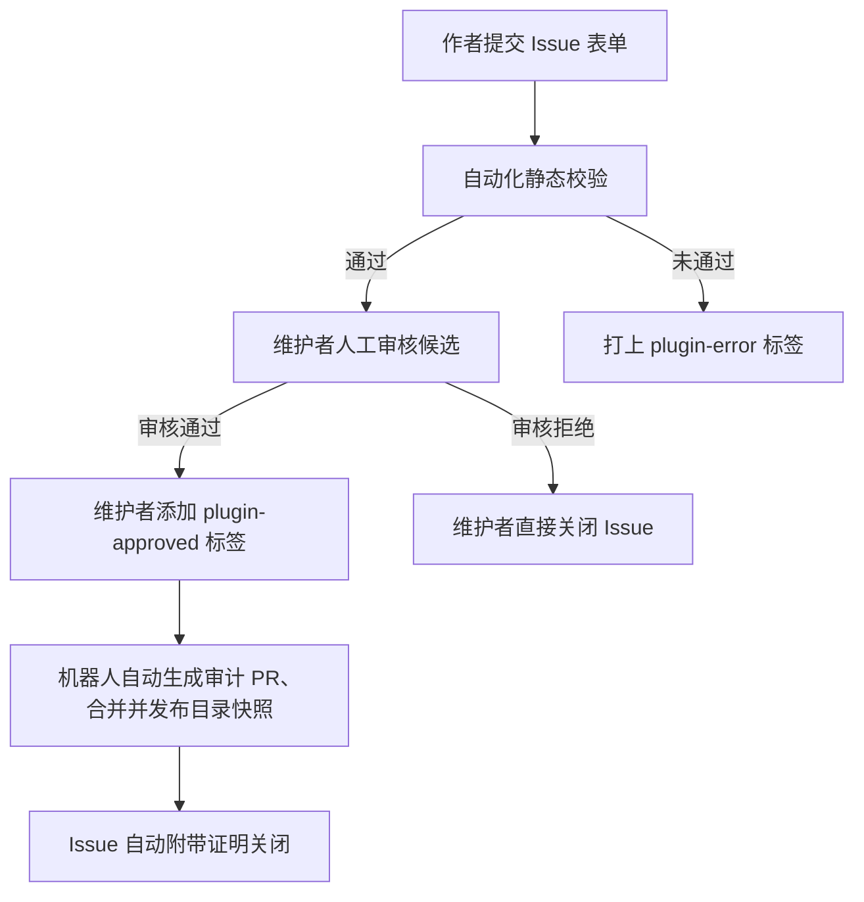

# Phinix 插件索引

  <a href="./README.md">English</a> · 简体中文

Phinix 托管插件官方目录与自动化准入审核仓库。

插件作者在自己的公开 GitHub 仓库中发布开源代码与发行资产；本仓库负责存储审核元数据、加密哈希指纹以及不可变的目录发行快照。

---

## 架构与分工边界

- **作者仓库**：托管插件源代码与固定版本 Release 压缩包（包含 DLL、`manifest.json` 与多语言 JSON 文件）。
- **索引仓库**：维护公开元数据目录、处理 Issue 申请表单、记录维护者批准凭据并发布目录快照。
- **分发端点**：提供权威 GitHub 直连访问（`phinix.official`）与 Cloudflare 镜像加速（`https://plugins.hunyuan2333.com`）。
- **游戏客户端**：玩家在游戏内插件商店中浏览、下载并安装已收录的插件。

> [!NOTE]
> 本索引仓库负责元数据管理与准入审核，**不运行**游戏插件代码，亦不承载联机服务器。通过目录审核仅验证插件的结构规范与元数据完整性，不代表官方对其游戏内业务行为做安全性背书。

---

## 插件作者提交指南

作者通过在本项目提交 Issue 表单申请收录。流程全程无需作者提供个人 Access Token 或自建机器人服务。

### 1. 准备候选包

在提交前，请确保您的插件符合以下规范：
- **公开仓库**：源代码仓库对公众公开可见。
- **固定版本发行**：在 GitHub Releases 发布正式版本（草稿与预发布版本不予受理）。
- **托管 DLL 压缩包**：ZIP 文件需包含 `manifest.json`、插件自有程序集以及包作用域的语言文件（`Resources/Localization/*.json`）。
- **禁止打包依赖**：严禁包含 RimWorld/Unity 游戏程序集（如 `Assembly-CSharp.dll`）、宿主程序集（如 `ClientExtensionAbstractions.dll`、`Utils.dll`）或 Harmony。
- **严禁包含凭据**：严禁在包内嵌入 API 私钥、通信密码或个人路径。

目录规范与结构示例可参考官方 [Phinix 示例插件](https://github.com/HunYuan2333/Phinix-Example-Plugin)。

### 2. 提交候选元数据

1. 点击 **Issues → New Issue → Plugin submission**。
2. 按照 [`examples/managed-submission.json`](examples/managed-submission.json) 模板填写候选信息。
3. 关键字段说明：
   - `id`：全局唯一包 ID（如 `author.plugin.name`）。
   - `version`：语义化版本号（如 `1.0.0`）。
   - `artifact`：Release 页面 URL、资产 ID、文件名及压缩包的 SHA-256 校验和。
   - `manifest`：与 ZIP 内 `manifest.json` 保持完全一致的元数据副本。
   - `localization`：多语言名称、简介与更新日志。

### 3. 静态检查反馈

Issue 提交或更新后，**Plugin intake** 工作流将自动运行静态检查：
- 严格的 JSON Schema 格式校验。
- 校验仓库所有权、Git Tag 与对应 Commit SHA。
- 核验 Release 资产 ID、文件大小与 SHA-256 真实性。
- 解析 PE 头部与清单声明，检查依赖声明与程序集占用。

检查结果将直接以评论形式反馈在 Issue 页面。

---

## 审核与自动化发布流程

### 审核规则

1. **维护者批准**：只有具备仓库权限的维护者才能通过添加 **`plugin-approved`** 标签批准申请。作者**严禁**自行添加批准标签。
2. **自动化证据 PR**：添加 `plugin-approved` 后，准入工作流自动触发，生成只包含元数据的审计 PR 并自动合入，记录候选哈希与审核凭证。
3. **目录自动发版**：合入后，发布工作流验证可见依赖闭包，自动生成 `catalog-v3-<commit>` 发行资产并原子更新 `stable.json`。
4. **自动关闭 Issue**：目录发布成功后，机器人将留下成功信息并自动关闭该 Issue。
5. **申请拒绝**：若维护者认为插件不合规，将不添加批准标签直接关闭 Issue。

---

## 失败排查与修改

| 标签状态 | 说明 | 处理方式 |
| :--- | :--- | :--- |
| `plugin-intake` | 静态检查执行中 | 等待机器人生成检查报告。 |
| `plugin-error` | 静态检查或发布流程报错 | 查看 Issue 评论及 Action 日志定位错误。 |
| `plugin-approved` | 维护者已批准 | 等待自动化 PR 合并及目录发布完成。 |

### 如何修改错误

- **元数据或资产不匹配**：若发布包在提交后发生了变动，重新计算 SHA-256 并更新 Issue 内容。编辑 Issue 会自动触发重新检查。
- **发布偶发中断**：若因 GitHub 临时网络问题导致发布失败，维护者可移除并重新添加 `plugin-approved` 标签触发重试。

---

## 目录分发与客户端访问

- **权威源**：`phinix.official`（通过 `main` 分支的 `stable.json` 索引）。
- **Cloudflare 加速端点**：提供不可变目录与资产缓存，地址为 `https://plugins.hunyuan2333.com/v1/sources/phinix.official/stable`。
- **客户端获取**：玩家在游戏内设置中可自由切换 GitHub 直连或 CF 加速。
- **更新生效边界**：目录发布仅更新远端商店列表，使插件在商店中可见；**绝不会**未经玩家允许静默向游戏客户端下载或安装任何文件。

---

## 维护者配置与运维

- **受控发布运维指引**：[`ControlledPublication.zh-CN.md`](ControlledPublication.zh-CN.md) — 权限配置、原子发布锁与故障恢复。
- **机器人自动化指引**：[`GitHubBotGuide.zh-CN.md`](GitHubBotGuide.zh-CN.md) — 事件监听、凭证与工作流设计。
- **源更新追踪策略**：[`SourceUpdates.zh-CN.md`](SourceUpdates.zh-CN.md) — 已批准源的自动化版本监测规则。
- **宿主模块配置**：[`HostModules.zh-CN.md`](HostModules.zh-CN.md) — 从主包产物更新 `host-module-profiles.json`。
- **目录排除清单**：`catalog-exclusions.json` 用于在不破坏审计锁的前提下隐藏特定条目（如开发测试插件）。
- **数据结构说明**：参考 [包数据说明](packages/README.md) 与 [审核记录说明](reviews/README.md)。
